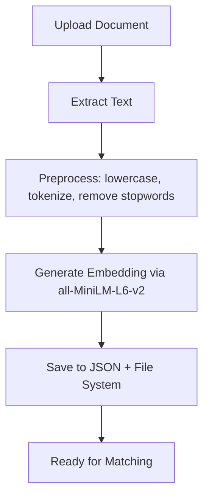

# Neuron - Resume ↔ Job Matcher API Documentation  
**hire.io Matching Engine Microservice**
---

## Overview

The **Neuron Matcher API** is a high-performance semantic matching engine that powers intelligent resume-to-job and job-to-candidate recommendations on **hire.io**. Built with **FastAPI** and powered by **Sentence Transformers (SBERT)**, it computes deep semantic similarity using vector embeddings and **cosine similarity** scoring.

> **Purpose**: Enable accurate, context-aware matching between candidate resumes (PDF) and job descriptions (text) — beyond keyword matching.

**Server Name**: `Neuron`  
**Base URL (Development)**: `{base-url}`  
**Production**: `https://neuron.hire.io`

---

## Technology Stack

| Component               | Tool/Library                                  |
|-------------------------|-----------------------------------------------|
| **Framework**           | FastAPI (async, auto-docs via Swagger)        |
| **NLP Preprocessing**   | SpaCy, NLTK                                   |
| **Embedding Model**     | `all-MiniLM-L6-v2` (Sentence Transformers)    |
| **Similarity Metric**   | Cosine Similarity (SciPy / scikit-learn)      |
| **PDF Text Extraction** | PyPDF2                                        |
| **Storage**             | Local JSON + file system (metadata + raw files) |

---

## Data Storage Structure

All data is stored locally for low-latency lookups.

| Resource             | Directory                | Metadata File             | Purpose |
|----------------------|--------------------------|----------------------------|-------|
| **Resumes**          | `resumes/`               | `resumes_meta.json`        | Stores `.pdf` files + user info, text, embeddings |
| **Job Descriptions** | `job_descriptions/`      | `jds_meta.json`            | Stores `.txt` or processed JD + metadata, embeddings |

> Embeddings are precomputed on upload and saved in metadata for instant matching.

---

## Match Scoring System

Raw cosine similarity (0.0 – 1.0) is converted to **percentage accuracy** and labeled:

| Score Range       | Label               | Interpretation |
|-------------------|---------------------|----------------|
| 85% – 100%        | **Excellent Match** | Near-perfect semantic alignment |
| 75% – 85%         | **Very Good Match** | Strong fit, likely qualified |
| 65% – 75%         | **Good Match**      | Relevant skills & experience |
| 45% – 65%         | **Fair Match**      | Partial overlap, may need review |
| 30% – 45%         | **Moderate Match**  | Some relevance, stretch candidate |
| 20% – 30%         | **Limited Match**   | Weak semantic connection |
| 0% – 20%          | **Minimal Match**   | Little to no alignment |

---

## API Endpoints

---

### 1. Upload Resume  
**`POST /upload/resume`**

Uploads a candidate resume (PDF), extracts text, generates embedding, and stores metadata.

#### Form Data
| Field       | Type | Required | Description |
|------------|------|----------|-----------|
| `user_id`  | string | Yes | Unique identifier (e.g., `U12345`) |
| `username` | string | Yes | Display name (e.g., `Nithyasarathi`) |
| `resume`   | file   | Yes | PDF resume file |

> If a resume exists for the same `username`, it is **replaced**.

#### Success Response (`200 OK`)
```json
{
  "resume_id": "b1d7b205"
}
```

---

### 2. Upload Job Description  
**`POST /upload/jobs`**

Submits a job description (text), computes embedding, and saves metadata.

#### Form Data
| Field         | Type   | Required | Description |
|--------------|--------|----------|-----------|
| `company`    | string | Yes | Company name |
| `job_title`  | string | Yes | Job title |
| `description`| string | Yes | Full job description text |

#### Success Response (`200 OK`)
```json
{
  "job_id": "eb4d9d3a"
}
```

---

### 3. Match Candidates to Job  
**`GET /match/candidates`**

Returns top matching **resumes** for a given **job ID**, ranked by semantic similarity.

#### Query Parameters
| Parameter | Type | Default | Required | Description |
|---------|------|---------|----------|-----------|
| `jobid` | string | — | Yes | Job ID (e.g., `eb4d9d3a`) |
| `count` | integer | `5` | No | Max results (must be > 0) |

#### Success Response (`200 OK`)
```json
[
  {
    "user_id": "U12345",
    "username": "Nithyasarathi",
    "resume": "b1d7b205.pdf",
    "accuracy": 82.55,
    "match": "Very Good Match",
    "job_id": "eb4d9d3a",
    "job_name": "Cloud Engineer Intern"
  },
  {
    "user_id": "U98765",
    "username": "Maheshkumar",
    "accuracy": 70.12,
    "match": "Good Match",
    "job_id": "eb4d9d3a",
    "job_name": "Cloud Engineer Intern"
  }
]
```

---

### 4. Match Jobs to Candidate  
**`GET /match/jobs`**

Returns top matching **jobs** for a given **resume ID**.

#### Query Parameters
| Parameter   | Type   | Default | Required | Description |
|------------|--------|---------|----------|-----------|
| `resumeId` | string | — | Yes | Resume ID (e.g., `b1d7b205`) |
| `count`    | integer| `5` | No | Max results |

#### Success Response (`200 OK`)
```json
[
  {
    "job_id": "7b491ee7",
    "company": "Azure Solutions",
    "job_title": "Cloud Administrator Intern",
    "accuracy": 79.98,
    "match": "Very Good Match",
    "resume_id": "b1d7b205",
    "username": "Nithyasarathi"
  },
  {
    "job_id": "1d9e5b3d",
    "company": "Ascentium",
    "job_title": "SDE Intern",
    "accuracy": 65.40,
    "match": "Good Match",
    "resume_id": "b1d7b205",
    "username": "Nithyasarathi"
  }
]
```

---

## Error Handling

| Status Code | Meaning                     | Example Message |
|-------------|-----------------------------|------------------|
| `400`       | Bad Request                 | `"Only PDF resumes allowed."` |
| `404`       | Not Found                   | `"Job ID not found."` |
| `422`       | Validation Error            | `"Field 'user_id' is required"` |

---

## Core Processing Pipeline



### Key Functions

1. **`preprocess_text(text)`**  
   → Clean and normalize text using SpaCy + NLTK.

2. **`st_model.encode(...)`**  
   → Convert text to 384-dimensional dense vector.

3. **`compute_similarity(target_emb, pool_embs)`**  
   → Compute cosine similarity:  
   $$
   \text{similarity} = \frac{\vec{A} \cdot \vec{B}}{\|\vec{A}\| \|\vec{B}\|}
   $$

4. **Upload Override Logic**  
   → On new resume with existing `username`: delete old file + metadata entry.

---

## Quick Start (cURL)

### Upload Resume
```bash
curl -X POST "{base-url}/upload/resume" \
  -F "user_id=U12345" \
  -F "username=Nithyasarathi" \
  -F "resume=@./resumes/nithya_resume.pdf"
```

### Upload Job
```bash
curl -X POST "{base-url}/upload/jobs" \
  -F "company=Google" \
  -F "job_title=SDE Intern" \
  -F "description=We are looking for interns skilled in Python, cloud, and system design..."
```

### Match Candidates
```bash
curl "{base-url}/match/candidates?jobid=eb4d9d3a&count=3"
```

---

**Neuron** — *Where Meaning Meets Opportunity.*  
*Powered by semantic intelligence. Built for hire.io.*